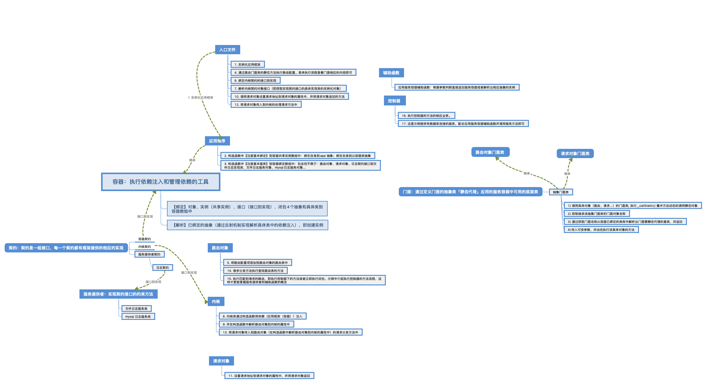

# laravel 应用层执行过程源码分析

Laravel 是优雅的 PHP Web 开发框架。具有高效、简洁、富于表达力等优点。采用 MVC 设计，是崇尚开发效率的全栈框架。是最受关注的 PHP 框架。

所以 laravel 框架本身的设计思想我认为值得我们每个 phper 去学习的。
虽然网上有很多关于介绍 laravel 启动过程的分析，不过我觉得一开始就直接用原生的 laravel 框架去分析可能对于大多数刚接触 laravel 的人来说会存在一定的障碍。
这个障碍也不一定是说理解能力上的障碍，更多的是来自于文字的表现形式的局限性不适用于直接拿 laravel 源码去分析。
不过可以通过阅读这篇文章后再看原生 laravel 的源码分析，思路可能会更加清晰点。（后面我会按照自己的展示方式把原生的 laravel 框架源码解读一遍，当然不一定够别人的好）

这里我通过一个手写的简易版框架去认识和了解 laravel 在应用层执行的过程。文章结尾附上执行流程的图片和源码供大家参考。

主要包含的内容有：**容器、应用框架、内核、契约、入口文件、服务提供者、路由、请求、门面、控制器及辅助函数。**

## 容器：执行依赖注入和管理依赖的工具
主要做了2件事情：

1. 【绑定】对象、实例（共享实例）、接口（接口到实现）、闭包4个抽象和具体类到容器数组中
2. 【解析】已绑定的抽象（通过反射机制实现解析具体类中的依赖注入），即创建实例

整一个框架里面就围绕这个容器提供依赖的，所以相当于一个心脏，也是 laravel 的一个心脏。这里贴出源码，后面就不贴了。
```容器
<?php
/**
 * [Description]
 *
 * @Author  leeprince:2020-03-11 19:28
 */
class Container
{
    // 绑定到容器的数组，相当于 bindings 与 $aliases
    protected $bind = [];

    // 当前实例，单例创建
    protected static $instance;

    // 绑定到容器的共享实例数组
    protected $instances = [];
    
    // 参数覆盖堆栈的数组
    protected $with = [];

    /**
     * [绑定到容器数组]
     *
     * @Author  leeprince:2020-03-11 19:36
     * @param $abstract
     * @param $concrete
     */
    public function bind($abstract, $concrete = null)
    {
        // 绑定自身
        if (is_null($concrete)) {
            $concrete = $abstract;
        }

        $this->bind[$abstract] = $concrete;
    }

    /**
     * [校验是否已绑定到容器]
     *
     * @Author  leeprince:2020-03-12 01:15
     */
    public function has($abstract)
    {
        return isset($this->bind[$abstract]);
    }

    /**
     * [绑定到共享实例中]
     *
     * @Author  leeprince:2020-03-12 01:17
     * @param $abstract
     * @param $instance
     */
    public function instance($abstract, $instance)
    {
        if (isset($this->bind[$abstract])) {
            unset($this->bind[$abstract]);
        }

        $this->instances[$abstract] = $instance;
    }

    /**
     * [获取当前实例]
     *
     * @Author  leeprince:2020-03-12 01:18
     * @return Container
     */
    public static function getInstance()
    {
        if (is_null(static::$instance)) {
            static::$instance = new static;
        }
        return static::$instance;
    }

    /**
     * [设置当前实例]
     *
     * @Author  leeprince:2020-03-12 01:19
     * @param $container
     * @return mixed
     */
    public static function setInstance($container)
    {
        return static::$instance = $container;
    }

    /**
     * [创建实例]
     *
     *      laravel 中是resolve 方法
     *
     * @Author  leeprince:2020-03-12 01:20
     * @param $abstract
     * @return mixed
     * @throws Exception
     */
    public function make($abstract, array $parameter = [])
    {
        // 判断是否在共享实例中，有直接返回
        if (isset($this->instances[$abstract])) {
            return $this->instances[$abstract];
        }
        
        $this->with[] = $parameter;
    
        // 再优化版本：通过反射机制继续递归解析具体类中的依赖注入：参考 IOC 的部分即可！
        if (isset($this->bind[$abstract])) {
            $concrete = $this->bind[$abstract];
            
            // 如果具体实现是闭包那么直接执行闭包，也不必绑定到共享实例中，因为闭包函数本身也不是实例。
            // 下列有3中判断是否是否一个闭包的方式。显然第一种更加专业
            if ($concrete instanceof Closure) {
            // if (is_object($concrete)) {
            // if (is_callable($concrete)) {
                return $concrete();
            }
    
            /**
             * 有两个版本
             */
            
            /** 版本1： 这是不考虑基于类的依赖注入的简单版本 */
            // return $this->instances[$abstract] = (empty($parameter))? new $concrete() : new $concrete(...$parameter);
    
            /** 版本2：通过反射机制考虑基于类的依赖注入的优化版本 */
            // 通过反射类，反射出该具体的所有信息
            $reflection = new ReflectionClass($concrete);
            if (! $reflection->isInstantiable()) {
                throw new Exception('反射后判断该类无法实例化');
            }
    
            // 获取构造函数
            $constructor = $reflection->getConstructor();
            if (is_null($constructor)) {
                $object = $reflection->newInstance();
    
            } else {
                // 获取构造函数参数
                $depenen = $constructor->getParameters();
                $instances = $this->getDependencies($depenen);
    
                $object = $reflection->newInstanceArgs($instances);
            }
            
            /**
             * 删除参数覆盖堆栈的数组的最后一条记录。
             *      因为这可能是递归解析基于类的依赖注入，
             *      如果不删除会导致在递归的上一步没有获取到当前解析中的参数覆盖的参数数组
             */
            array_pop($this->with);
            
            return $this->instances[$abstract] = $object;
            
        }
        
        throw new Exception('没有找到实例'.$abstract);
    }
    
    /**
     * [根据构造函数中的类型提示参数（依赖注入：基于类的依赖注入或者非基于类的原始依赖注入）中继续实例化对象]
     *
     * @Author  leeprince:2020-03-15 13:12
     * @param array $depenen
     * @return array
     * @throws Exception
     */
    public function getDependencies(array $dependencies)
    {
        $results = [];
        foreach ($dependencies as $key => $dependency) {
            // 确定给定的依赖项是否具有参数替代
            if ($this->hasParameterOverride($dependency)) {
                $results[] = $this->getParameterOverride($dependency);
                continue;
            }
    
            // 考虑构造函数的参数是不是基于类的依赖注入
            $results[] = is_null($dependency->getClass())
                ? $this->resolvePrimitive($dependency, $key)
                : $this->resolveClass($dependency);
        }
        
        return $results;
    }
    
    /**
     * [解析非基于类的原始依赖]
     *
     * @Author  leeprince:2020-03-15 15:47
     * @param ReflectionParameter $parameter
     * @param $key
     * @return mixed
     * @throws ReflectionException
     */
    public function resolvePrimitive(ReflectionParameter $parameter, $key)
    {
        if ($parameter->isDefaultValueAvailable()) {
            return $parameter->getDefaultValue();
        }
        
        return null;
    }
    
    /**
     * [解析容器中基于类的依赖]
     *
     * @Author  leeprince:2020-03-15 15:29
     * @param ReflectionParameter $parameter
     * @return mixed
     * @throws Exception
     */
    public function resolveClass(ReflectionParameter $parameter)
    {
        return $this->make($parameter->getClass()->name, []);
    }
    
    
    /**
     * [确定给定的依赖项是否具有参数替代。]
     *
     * @Author  leeprince:2020-03-15 16:17
     * @param $dependency
     * @return bool
     */
    protected function hasParameterOverride(ReflectionParameter $dependency)
    {
        return array_key_exists(
            $dependency->name, $this->getLastParameterOverride()
        );
    }
    
    /**
     * [获取依赖项的参数覆盖。]
     *
     * @Author  leeprince:2020-03-15 16:18
     * @param ReflectionParameter $dependency
     * @return mixed
     */
    protected function getParameterOverride(ReflectionParameter $dependency)
    {
        return $this->getLastParameterOverride()[$dependency->name];
    }
    
    /**
     * [获取最后一个参数覆盖]
     *
     * @Author  leeprince:2020-03-15 16:23
     * @return array|mixed
     */
    protected function getLastParameterOverride()
    {
        return count($this->with) ? end($this->with) : [];
    }
}
```

## 应用程序
主要也是做2件事：在构造函数中注册基本绑定和注册基本服务
    
1. 构造函数中【注册基本绑定】到容器共享实例数组中：绑定自身到app 抽象；绑定自身到从容器类抽象
2. 构造函数中【注册基本服务】到容器绑定数组中：包含但不限于：路由对象、请求对象、日志契约接口到文件日志实现类、文件日志服务对象、mysql日志服务对象...

## 内核

1. 绑定内核契约的接口到实现
2. 内核类通过构造函数将依赖（应用框架（容器））注入
3. 并在构造函数中解析路由对象到内核的属性中
4. 将请求对象传入到路由对象（在构造函数中解析路由对象到内核的属性中）的请求分发方法中

## 契约：契约是一组接口，每一个契约都有框架提供的相应的实现
容器契约
内核契约
服务提供者契约
    日志契约

## 入口文件
主要做了5件事，执行顺序也是按照下面执行，当然可以调整，只不过为了更好理解我就这么排了

1. 实例化应用框架
2. 通过路由门面类的静态方法执行路由配置。具体执行流程查看门面相应的内容即可
3. 解析内核契约对象接口（即获取实现契约接口的具体实现类的实例化对象）
4. 调用请求对象设置请求地址到请求对象的属性中，并将请求对象返回的方法
5. 将请求对象传入到内核的处理请求方法中

## 服务提供者
这里主要介绍的是服务的概念。设计思路与 laravel 关于服务提供者实现的不一样，对这块感兴趣的朋友可以看下源码或者留言一起讨论

文件日志服务类：实现契约接口的约束方法
mysql 日志服务类：实现契约接口的约束方法

## 路由对象
主要做了3件事
    
1. 将路由配置项添加到路由对象的路由表中
2. 请求分发方法执行查找路由表的方法
3. 执行匹配到请求的路由，即执行控制器下的方法或者立即执行闭包。示例中介绍执行控制器的方法流程，这样才更能掌握服务提供者和辅助函数的概念

## 请求对象
设置请求地址到请求对象的属性中，并将请求对象返回

## 门面：通过定义门面的抽象类，「静态代理」应用的服务容器中可用的底层类
门面的抽象类

1. 调用具体对象（路由、请求...）的门面类, 执行__callStatic() 魔术方法动态的调用静态对象
2. 获取继承该抽象门面类的门面对象名称
3. 通过获取门面名称从容器已绑定的类库中解析出门面要静态代理的基类，并返回
4. 传入可变参数，并动态执行该具体对象的方法

## 控制器
1. 执行控制器的方法的相应业务。
2. 这里示例提供有数据库连接的服务，配合应用服务容器辅助函数并调用服务方法即可

## 辅助函数
应用服务容器辅助函数：根据参数判断直接返回服务容器或者解析出相应抽象的实例

## 执行流程
执行的顺序以 「阿拉伯数字.」 做为顺序阅读


## 源码地址
https://github.com/leeprincefoxmail/my_pattern/tree/master/my_minilaravel


---
这框架只是为让大家一起了解和熟悉 laravel 在应用层的加载过程。当然 laravel 框架本身还有很多核心的架构，比如服务提供者、管道、中间件有时间我再补上（已补上，请看看我的主页上的《laravel 管道及中间件源码分析》）

欢迎大家留言一起讨论～


